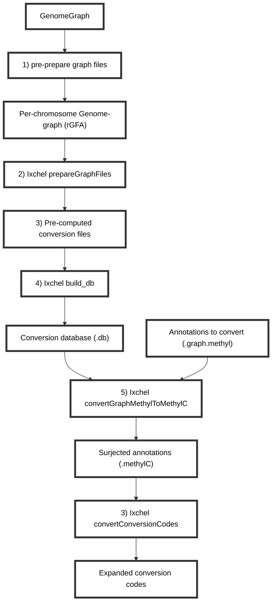

# Annotation surjection with Ixchel
Ixchel is a genome-graph based tool intended to aid in the conversion of annotations in graph-coordinates to linear coordinates.
It is early in development and currently only has functionality designed for surjecting annotations (.graph.methyl) data for CpG sites.
Currently, it only works with CpG sites, but the goal is to expand it to other types of annotations.

The main steps of the Ixchel process are:
1. Pre-prepare the graph files: The graph must be split by chromosome and be in rGFA format.
2. Prepare the graph files: This step takes the rGFA graph and generates a set of intermediate files needed to pre-compute conversions.
3. Precompute conversion files: This step generates pre-computed conversion files that will be used in the surjection process.
4. Build the surjection database: This step creates a database that maps the graph coordinates to linear coordinates.
5. Convert GraphMethyl to MethylC: This step converts the annotations in graph coordinates to methylC format.

Given the tremendous size of genomes, the steps will likely need to be run individually on a cluster. I will be providing pre-computed conversion files for the human pangenome. So the average use will start at step 5, as I will have run steps 1-4 for you for all stable releases of the human pangenome.

If you want to run it on your own graph, you will need to prepare the graph files first. Due to resource constraints, pre-computed conversions *must* be performed per-chromosome. I strongly recommend against trying to run this on the entire genome at once.
Splitting graphs can be done using `vg chunk` if the MC workflow wasn't set to split the graph by chromosome. I strongly recommend having the MC workflow split the graph by chromosome rather than trying to split it after the fact.
Once the graph files are split per-chromosome, they are typically in `.vg` format. This must be converted to `.gfa` format, however `Ixchel` specifically requires the graph to be in rGFA format. It will fail to convert anything if it is not in rGFA format.
A step-by-step example of how I have prepared a such a graph starting from `.vg` files can be found [here](ELN_Notes/Processs_hprc_v1_1_mc_chm13.md).

links to split versions of HPRC graphs can be found [here](https://github.com/human-pangenomics/hpp_pangenome_resources).

lookup databases needed to run Ixchel can be found [here](BLANK). These are compressed files files and must be uncompressed before running Ixchel.

## Overview of Ixchel process


## Run Ixchel end-to-end
Ixchel requires a genome graph in rGFA format. It was designed to work with graphs produced by minigraph-cactus and is compatible with the human pangenomes available [here](https://github.com/human-pangenomics/hpp_pangenome_resources). However, for large graphs the following simple example will not work well.
It is run in two steps:
1. Prepare the graph files
2. Convert the graph.methyl annotations to methylC format
```bash
cd /scratch/hllab/Juan/Ixchel_Dev_Tests/VGPlayGround
srun --mem=8000 --cpus-per-task=1 -J interactive -p interactive --pty /bin/bash -l
eval $( spack load --sh python@3.7.3 )
eval $( spack load --sh py-numpy/i7mcgz4 )
eval $( spack load --sh py-jsonpickle@1.4.1 )
# py-dill@0.3.4
eval $( spack load --sh py-dill/aldouqp )
# py-tqdm@4.65.0
eval $( spack load --sh py-tqdm/nfnho45 )
```
### Prepare the graph files
```bash
python3 /scratch/hllab/Juan/Ixchel/SourceCode/Ixchel.py prepareGraphFiles TestGraph.gfa --reference_name GRCh38
```
### Precompute conversion files
````bash
python3 /scratch/hllab/Juan/Ixchel/SourceCode/Ixchel.py precompute_conversion split_annotations/Annotations.Segments.TestGraph__00001 RefOnly.Segments.TestGraph.pkl QueryOnly.Segments.TestGraph.pkl FilteredLinks.Links.TestGraph.pkl UpstreamArray.RefOnly.Segments.TestGraph.pkl DownstreamArray.RefOnly.Segments.TestGraph.pkl DoubleAnchored.FilteredLinks.Links.TestGraph.pkl
````
### Build the surjection database
```bash
python3 /scratch/hllab/Juan/Ixchel/SourceCode/Ixchel.py build_db split_annotations/Annotations.Segments.TestGraph__00001.converted Annotations.Segments.TestGraph__00001.converted.db
```
### Convert GraphMethyl to MethylC
```bash
python3 /scratch/hllab/Juan/Ixchel/SourceCode/Ixchel.py convertGraphMethylToMethylC Example.CG.graph.methyl Annotations.Segments.TestGraph__00001.converted.db Example.CG.graph.methyl.methylC
```
### Extract and interpret codes
Ixchel uses a set of codes to represent the context of segments in the graph.
Context that affects how precisely the segment can be surjected to linear coordinates.
```bash
python3 /scratch/hllab/Juan/Ixchel/SourceCode/Ixchel.py convertConversionCodes Example.CG.graph.methyl.methylC
```

*For further support contact: juanfmacias[at]wustl.edu*