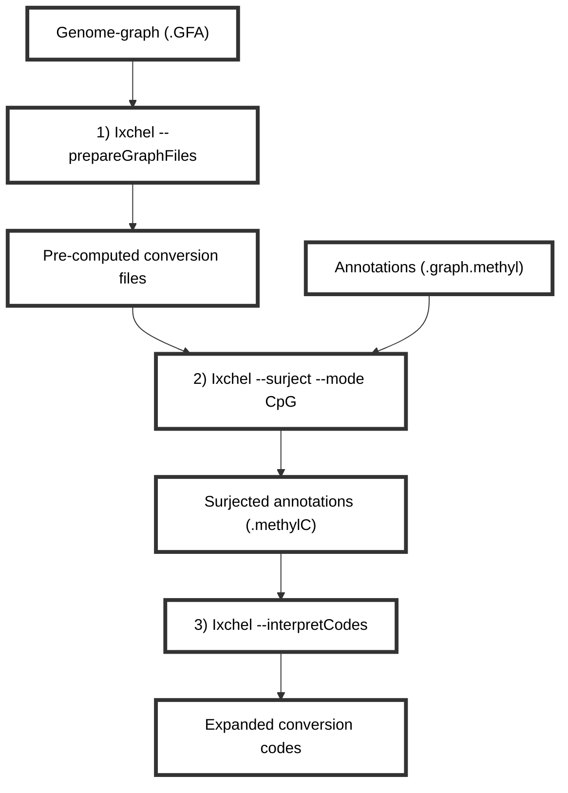

# Annotation surjection with Ixchel
Ixchel is a genome-graph based tool intended to aid in the conversion of annotations in graph-coordinates to linear coordinates.
It is early in development and currently only has functionality designed for surjecting annotations (.graph.methyl) data for CpG sites.

### Overview of Ixchel process

## Prepare the graph files
Ixchel requires a genome graph in GFA format. It was designed to work with graphs produced by minigraph-cactus and is compatible with the human pangenomes available [here](https://github.com/human-pangenomics/hpp_pangenome_resources).

## Run surjection

## Extract and interpret codes

