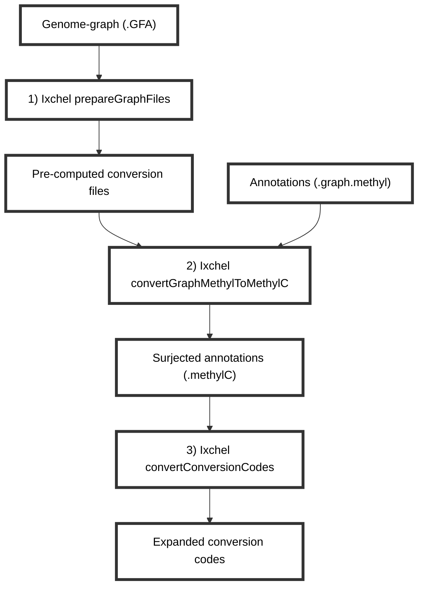

# Annotation surjection with Ixchel
Ixchel is a genome-graph based tool intended to aid in the conversion of annotations in graph-coordinates to linear coordinates.
It is early in development and currently only has functionality designed for surjecting annotations (.graph.methyl) data for CpG sites.
Currently, it only works with CpG sites, but the goal is to expand it to other types of annotations.
Given the tremendous size of genomes, the steps will likely need to be run individually on a cluster.

## Overview of Ixchel process


## Run Ixchel end-to-end
Ixchel requires a genome graph in GFA format. It was designed to work with graphs produced by minigraph-cactus and is compatible with the human pangenomes available [here](https://github.com/human-pangenomics/hpp_pangenome_resources).
It is run in two steps:
1. Prepare the graph files
2. Convert the graph.methyl annotations to methylC format
```bash
cd /scratch/hllab/Juan/Ixchel_Dev_Tests/VGPlayGround
srun --mem=8000 --cpus-per-task=1 -J interactive -p interactive --pty /bin/bash -l
eval $( spack load --sh python@3.7.3 )
eval $( spack load --sh py-numpy/i7mcgz4 )
eval $( spack load --sh py-jsonpickle@1.4.1 )
eval $( spack load --sh py-dill@0.3.4 )
```
### Prepare the graph files
```bash
python3 /scratch/hllab/Juan/Ixchel/SourceCode/Ixchel.py prepareGraphFiles TestGraph.gfa
```
### Convert GraphMethyl to MethylC
```bash
python3 /scratch/hllab/Juan/Ixchel/SourceCode/Ixchel.py convertGraphMethylToMethylC Example.CG.graph.methyl Annotations.Segments.TestGraph.gfa.pkl
```
### Extract and interpret codes
Ixchel uses a set of codes to represent the context of segments in the graph.
Context that affects how precisely the segment can be surjected to linear coordinates.
```bash
python3 /scratch/hllab/Juan/Ixchel/SourceCode/Ixchel.py convertConversionCodes Example.CG.graph.methylc
```

*For further support contact: juanfmacias[at]wustl.edu*